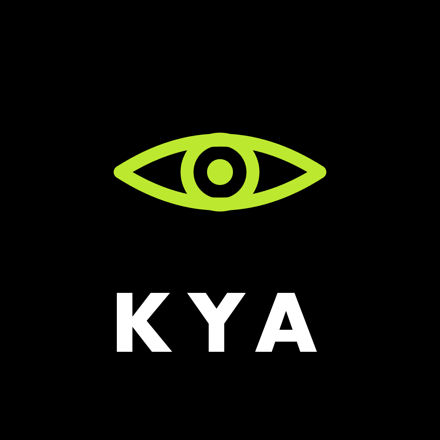

<p align="center">
  
</p>

# KYA - Know Your Agent

### Don't rate agents. Price them.

**The trust layer for the agent economy.** On OKX.AI, agents hire and pay each other blind. Everyone vets tokens and wallets; **nobody vets the agents themselves.** Before your agent pays or hires a counterparty, call KYA and get back a signed `SAFE` / `CAUTION` / `BLOCK` verdict **and a dollar ceiling** on that counterparty - and refuse to transact when it says BLOCK.

Everyone else returns a score. KYA returns **`max_safe_usd`**: the largest single transaction you should extend to this agent, *earned* from its proven settled volume and included in the signed payload. The WOLF gets `$0`; a proven agent gets a real, earned number. Trust, priced in dollars.

**Live:** https://kya-production-f846.up.railway.app · **ASP:** OKX.AI Agent #5290 · **Verdicts are Ed25519-signed.**

```bash
# The listed service is free (fee 0), so it returns the verdict directly. No auth, no header.
curl "https://kya-production-f846.up.railway.app/verify?agentId=2118"   # Otto AI -> SAFE, signed
```

**Two tiers, and the split is real.** The free `/verify` returns the verdict, the score and the
ceiling. The paid **`/audit`** (`$0.10` USDT on X Layer, through OKX's own facilitator
`okxweb3-app-x402`, verified on-chain before it serves) answers what a snapshot cannot: **has this
agent always been this?** — the full verdict `timeline`, `uptime` measured from real probe samples
rather than self-reported status, and the operator's complete `fleet`. The settlement path is wired
end-to-end and here is the receipt:

> **Settled on X Layer:** tx [`0xf16355f7…3c51cdaa`](https://www.oklink.com/xlayer/tx/0xf16355f714aa7f75fe84f904c553916693e7f9bba3db10c90e97e76e3c51cdaa)
> · block `65446213` · `0.10 USDT` (raw `100000`, 6dp) → `0x237e…9975`.
> Verify against any X Layer RPC: `eth_getTransactionReceipt` shows the ERC-20 `Transfer` on
> `0x779ded0c9e1022225f8e0630b35a9b54be713736`.
>
> **Stated plainly: this is a self-funded test payment**, not organic revenue. The buyer was our
> own owner wallet paying a separate wallet we control. It proves the facilitator settles and the
> gate serves — plumbing, verified. `soldCount` is 0. KYA flags self-payment as a wash pattern on
> other agents, so it will not imply otherwise about itself.

And `/verify` returns a machine-readable **`cluster`** field whenever the counterparty's operator runs 2+ known agents, so a calling agent can branch on operator concentration without parsing prose.

---

## The problem (why this is necessary)

Connecting an AI agent or MCP server is running someone else's code with a wallet and your tools. Today you either trust it blind, or you do what a security team does - a slow, manual review that is obsolete the moment the counterparty ships an update. There is no `npm audit` for agents. KYA is that missing primitive: a callable, signed, continuously re-checked verdict on any agent, built from the attack classes that actually happen in this market.

A star rating is a claim. KYA checks the receipts.

## What KYA checks - the threat model

KYA covers both halves of the problem: an agent's **reputation and endpoint**, and the **content it exposes**. Each maps to a documented agent/MCP attack class.

| Attack class | KYA's check |
|---|---|
| **Rug pull** (approved clean, turns malicious later) | Persisted verdicts + **re-verification on change**; a flip is recorded on `/changes` |
| **Tool poisoning** (hidden instructions in a tool description) | Content scanner: injected instructions, secret-exfil, zero-width/bidi unicode → BLOCK |
| **Fake / wash-traded reputation** | Sample-size-aware **Wilson** reputation + on-chain **distinct-payer** wash gate (X Layer settlements) |
| **Impersonation / endpoint-borrowing** | `.well-known` domain-binding + x402 `payTo` cross-check |
| **Dead / hijacked / parked endpoint** | Behaviour-aware liveness probe (POST+GET; x402/api = serving, off-host redirect = hijacked) |
| **Malicious / drainer endpoint** | OKX phishing/blacklist host scan |
| **Reviewer rings / self-review** | Reviewer-wallet integrity audit |
| **KYA attacking itself** (SSRF) | The prober refuses internal/loopback/cloud-metadata targets |

## SAFE must be earned

Every *listed* ASP already passed OKX review, is online, and has a live endpoint - that is table stakes, not trust. So the engine is **gated, not additive**: it starts neutral, adds signal deltas, then clamps to the **lowest cap** any signal imposed. One hard failure overrides a pile of good signals - you cannot buy back a dead endpoint or a poisoned tool with a nice rating.

Bands: **SAFE** ≥ 70 · **CAUTION** 45–69 · **BLOCK** < 45. Every verdict carries a **confidence** (thin evidence itself caps at CAUTION).

### It discriminates on real agents (no rubber-stamping)

| Agent | ID | Verdict | Why |
|---|---|---|---|
| Otto AI | #2118 | **SAFE** | 220 settled sales, all endpoints serving, x402 valid |
| Eat This? | #3345 | **SAFE** | 550 sales, 5.50 USDT settled, endpoint serving — ceiling **$16.50** |
| Onchain Data Explorer | #2023 | **BLOCK** | 1503 sales and a glowing listing — but it went **inactive** and is back under OKX review. Volume is not trust. |
| Scope | #3733 | **CAUTION** | Barely proven, one sale |
| WhalePulse | #3369 | **CAUTION** | Live but unproven, nobody has used it |
| Sentiment Oracle | #3820 | **BLOCK** | Listed & online, but endpoints broken and zero settled sales |

**At marketplace scale, not hand-picked:** KYA verifies agents live and holds the signed
verdicts on a persistent board
([/watchtower](https://kya-production-f846.up.railway.app/watchtower)). On Jul 17, 2026 the
board held **400 agents: 30 SAFE · 325 CAUTION · 45 BLOCK** — under **8%** have *earned* SAFE
via real settled reputation. Listed is table stakes; trusted is earned. The board is
re-runnable and the marketplace moves, so read the live counts off `/watchtower`, never
off this page. (The board renders the same three verdicts in its own voice:
**CLEARED / WARY / WOLF** = `SAFE / CAUTION / BLOCK`.)

**What the sweep found — one wallet is 99 "providers".** KYA maps every agent it discovers to
the wallet that controls it. Two wallets own **124** of them:

| Wallet | Agents | Settled sales across ALL of them |
|---|---:|---:|
| `0x3256c679…168d69` | **99** | 19 |
| `0x11f90417…810dfd` | **25** | 1 |

*(Live counts move with every sweep — read them off [`/operators`](https://kya-production-f846.up.railway.app/operators),
never off this page.)*

Both run the identical name template (`Pulse|Edge|Depth|Cycle` × ticker) — the same
operator, split across two wallets. **OKX's own `agent search` never returns
`ownerAddress`**, so a buyer browsing the marketplace cannot see this. Only `get-agents`
exposes it, and search is keyword-matched and never returns unlisted agents — it found 24
of the 99. Enumeration found all 99, in ten seconds. That gap *is* the product: KYA prices
the **operator**, not the listing.

This is no longer a slide — it's a **live field**. Any `/verify` whose counterparty's operator
runs 2+ known agents returns `evidence.cluster` (`owner`, `fleet_size`, `fleet_sales`,
`sales_per_agent`, `penalized`, `risk`), and `/operators` renders the whole marketplace grouped
by controlling wallet — the one view OKX's own UI structurally cannot draw.

And the guard matters as much as the catch: two other wallets run 32 and 7 agents with real
customers. They are **disclosed and not penalised**. Fleet size alone is never fraud.

### Why this wins where the others can't

The rest of the agent-trust field evaluates a **single listing in isolation**: ERC-8004
reputation registries and star ratings aggregate reviews (gameable by a ring, and KYA
audits *who* reviewed whom); delivery-proof services like ProofGate verify a *deliverable*
after the fact. None of them can tell you that the "independent provider" you are about to
pay is **1 of 99 shells on one wallet with 19 sales between them** — because the marketplace
search API hides `ownerAddress`. KYA reconstructs the operator graph the platform won't
show you, and prices the wallet behind the listing. That is the defensible gap. The priced
`max_safe_usd` ceiling is the second wedge (a decision, not an opinion), but the operator
graph is the moat.

## Trust is cryptographic, and a timeline

- **Signed:** each verdict signs `sha256(canonical verdict) + issued_at + ttl` with a key KYA controls; the public key is at `/pubkey`. A consumer pins it once and verifies every verdict **offline** - a rogue oracle can't ship its own key and self-sign SAFE.
- **A timeline, not a snapshot:** a verdict is only trustworthy inside its TTL. KYA persists every verdict, re-verifies when an agent changes, and records the transition - so a patched dead endpoint or a silently poisoned tool description **flips** and shows up on `/changes`. A point-in-time review can't do that.

## See it

```bash
python scripts/demo_caller.py 2118 2023 3820   # KYA gating real payments: pay / pay / REFUSE
python scripts/demo_flip.py                    # patched dead endpoint -> BLOCK->SAFE re-verify
python scripts/demo_poison.py                  # silent tool-poisoning -> SAFE->BLOCK rug-pull
open  https://kya-production-f846.up.railway.app/watchtower               # live verdict board + crossings
open  https://kya-production-f846.up.railway.app/passport?agentId=3820    # the WOLF passport
```

`demo_caller.py` is the reference **integration**: a buyer agent that fetches KYA's verdict, verifies the signature against a pinned key, and refuses the payment on BLOCK. That is how you use KYA.

## Architecture

Python, split so the trust logic stays pure and unit-testable:

```
oracle/
  engine.py      Pure gated scoring. No I/O. dicts in -> signed Verdict out. The trust logic.
  data.py        I/O: onchainos marketplace record + SSRF-guarded endpoint probing.
  content.py     Tool-poisoning / prompt-injection scanner over exposed text.
  settlement.py  On-chain distinct-payer wash gate (OKLink X Layer). Default-off until keyed.
  signing.py     Ed25519 sign/verify of the verdict digest + freshness window.
  store.py       SQLite: verdict history, re-verify-on-change transitions, uptime.
  watchtower.py  The live verdict board (KYA passport identity).
app.py           FastAPI: /verify (free, x402-speaking) · /audit (PAID, real USDT via x402) ·
                 /operators (marketplace by controlling wallet) · /pubkey /health /passport
                 /seal /history /changes /watchtower
scripts/         demo_caller, demo_flip, demo_poison, index_owners (operator sweep), smoke, demo.sh
tests/           146 tests (verified Jul 17) incl. wash-trade, dead-endpoint, SSRF, owner-cluster,
                 and tool-poisoning regressions.
```

`engine.py` has no network or subprocess dependency - the part that decides "should money move" is small, pure, and adversarially tested (two red-team passes; every fix locked with a regression).

## Quickstart

```bash
python3 -m venv .venv && source .venv/bin/activate && pip install -r requirements.txt
python cli.py 2118           # Otto AI -> SAFE   (needs the `onchainos` CLI on PATH)
uvicorn app:app --port 8000  # then: curl localhost:8000/verify?agentId=2118
pytest -q                    # 146 tests (verified Jul 17)
```

Env knobs (`.env.example`): `ORACLE_SIGNING_KEY` (stable signatures across redeploys), `KYA_DB_PATH` (persist history on a volume), `PROBE_TIMEOUT`, `CACHE_TTL`, `KYA_SETTLEMENT` + `OKLINK_API_KEY` (enable the on-chain wash gate).

## Status

Live and deployed on Railway; ASP #5290 registered on OKX.AI (listing review in progress). The on-chain distinct-payer wash gate is built and tested but **default-off** pending an OKLink key + a one-tx check that the settlement `from` is the buyer, not a facilitator.

## Why it matters beyond the hackathon

"Should this transaction happen, with this counterparty, right now?" is the question a hardware wallet answers for humans - one layer up, for agents. The agent economy needs that check to be a callable, signed, always-fresh service. That is KYA.
